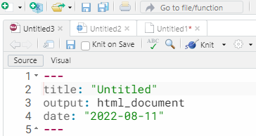
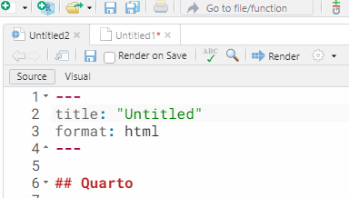

```{r, child="00-preamble.Rmd"}

```

class: middle, center

# Sobre a Curso-R

---

class: middle, center

## A empresa

.pull-left[
```{r, echo = FALSE, out.width="70%"}
knitr::include_graphics("https://d33wubrfki0l68.cloudfront.net/295643c6243701ae6a9bac3fb8ad467ff0ce3c84/d1785/img/logo/cursor1-41.png")
```

<br>
<br>

```{r, echo = FALSE, out.width="70%"}
knitr::include_graphics("img/logo_r6.png")
```

]

.pull-right[
```{r, echo = FALSE, out.width="70%"}
knitr::include_graphics("img/produtos.png")
```
]

### [www.curso-r.com](https://www.curso-r.com)


---
class: middle, center

```{r, echo = FALSE}
templatesR6::criar_slide_nossos_cursos()
```


---
class: middle, center

# Sobre o curso

---

# Relatórios e apresentações automáticas


```{r, echo=FALSE, out.width="70%", fig.align='center', fig.cap="Ilustração por <a href='https://github.com/allisonhorst/stats-illustrations'> Allison Horst</a>."}
knitr::include_graphics("https://github.com/allisonhorst/stats-illustrations/blob/main/openscapes/environmental-data-science-r4ds-general.png?raw=true")
```


---
class: middle, center

```{r, echo=FALSE, out.width="70%", fig.align='center', fig.cap="Ilustração por <a href='https://github.com/allisonhorst/stats-illustrations'> Allison Horst</a>."}
knitr::include_graphics("https://github.com/allisonhorst/stats-illustrations/blob/main/rstats-artwork/rmarkdown_wizards.png?raw=true")
```


---

# Resultados


.pull-left[

No final, você poderá...

- Criar documentos reprodutíveis (como relatórios e apresentações)

- Compartilhar suas análises usando R em todas as etapas do ciclo da ciência de dados


]

.pull-right[

```{r, echo=FALSE, out.width="100%", fig.align='center', fig.cap="Ilustração por <a href='https://github.com/allisonhorst/stats-illustrations'> Allison Horst</a>."}
knitr::include_graphics(c("https://github.com/allisonhorst/stats-illustrations/blob/main/rstats-artwork/reproducibility_court.png?raw=true"))

```

]

---

# Dinâmica

- Exercícios para casa, com entrega facultativa

- __Trabalho final__, com entrega obrigatória
    - As pessoas que fizerem os trabalhos __mais legais__ receberão uma __bolsa__ para fazer qualquer curso da Curso-R
    - Mais detalhes sobre o trabalho final nas próximas aulas :)

---

# Tirando dúvidas

- **Não existe dúvida idiota**.
 
- Nem sempre é trivial fazer a pergunta certa para que outra pessoa esclareça a sua dúvida. Neste curso, **vamos mostrar melhores práticas na hora de fazer perguntas sobre programação**.
 
- Fora do horário de aula ou monitoria:
  - perguntas gerais sobre o curso deverão ser feitas no Classroom.
  - perguntas sobre R, principalmente as que envolverem código, deverão ser enviadas no [nosso discourse](https://discourse.curso-r.com/). Se envolver web scraping, é importante especificar a página que está querendo acessar e como você faria para encontrá-la manualmente.

- [Veja aqui dicas de como fazer uma boa pergunta](https://discourse.curso-r.com/t/como-escrever-uma-boa-pergunta/542).

---
# Por que usar o discourse?

- Muito melhor para escrever textos que possuem códigos. Com ele, podemos usar o pacote `{reprex}`!

- Saber pesquisar sobre erros e fazer a pergunta certa é essencial para aprender e resolver problemas de programação.

- No discourse, teremos mais pessoas acompanhando e respondendo as dúvidas.

- Em um ambiente aberto, as suas dúvidas vão contribuir com a comunidade.

### https://discourse.curso-r.com/


---
class: center, middle, inverse

# Trabalho final

---

## Trabalho final

- Neste curso, utilizaremos uma base de dados para criar um produto para comunicar uma análise de dados (relatório, apresentação, site, etc). 

- O trabalho final de vocês será criar um também!

  - Escolha uma base de dados que você ache interessante!
  
  - Defina um objetivo da análise.
  
  - Defina um público alvo: a comunicação depende de quem vai ver.
  
  - Defina qual formato você quer gerar.
  
  - Faça sua análise depois de cada aula, será possível avançar no trabalho. Tragam dúvidas nas monitorias. Isso será a tarefa semanal de vocês. Também teremos leituras adicionais.
  
  - Entrega: Uma pasta com o projeto `.Rproj`, o código da análise (em .Rmd ou .qmd), o arquivo final (seja PDF, HTML, Word, etc), e quaisquer outros arquivos necessários. Se quiser, deixe em um repositório público no GitHub e envie o link.
  
- Pontos de avaliação: Reprodutibilidade, efetividade da comunicação, atributos estéticos, engajamento na leitura.


---
class: center, middle, inverse

# Introdução ao RMarkdown

## Aula 1

---
# O que é RMarkdown?

- O R Markdown é um pacote para criação de __relatórios automatizados__ utilizando as linguagens de programação R e de marcação Markdown. 

> Linguagens de marcação utilizam marcadores (símbolos, tags, funções) para formatar um arquivo de texto simples. Os exemplos mais famosos de linguagem de marcação são o HTML e LaTeX.

- A linguagem de marcação Markdown serve para construirmos e formatarmos diversos formatos de arquivos (PDF, HTML, Word, entre outros) a partir de um arquivo de texto com regras bem simples. 

- O __RMarkdown__ é uma extensão de Markdown que nos permite __colocar código de R__.


---
## Por que o RMarkdown é legal?

- Possibilita automatizar a criar produtos com o R. Construindo um relatório em RMarkdown, com exceção das interpretações e conclusões, só precisamos montá-lo uma vez. A partir daí, com apenas um clique podemos:

  - replicar o relatório para diversas versões da base de dados (modificações, correções, processos periódicos);

  - replicar o relatório para diversas variáveis.
  
.pull-left[
- Criar documentos reprodutíveis

- Criar diversos tipos de produtos 
]

.pull-right[
```{r, echo=FALSE, out.width="100%", fig.align='center', fig.cap="Ilustração por <a href='https://github.com/allisonhorst/stats-illustrations'> Allison Horst</a>."}
knitr::include_graphics("https://github.com/allisonhorst/stats-illustrations/blob/main/rstats-artwork/reproducibility_court.png?raw=true")

```
]


---

# Algumas aplicações

```{r echo=FALSE}
exemplos_rmd <- tibble::tibble(pacote = as.character(),
               desc = as.character(),
               exemplos = as.character()) %>%
  
  tibble::add_row(pacote = "[blogdown](https://bookdown.org/yihui/blogdown/)",
                  desc = "Blogs e sites",
                  exemplos = "- [Site da Curso-R](https://curso-r.com/) <br> - [Site da Associação Brasileira de Jurimetria (ABJ)](https://abj.org.br/)") %>%
  
  tibble::add_row(pacote = "[distill](https://rstudio.github.io/distill/)",
                  desc = "Blogs e sites",
                  exemplos = "- [RStudio AI Blog](https://blogs.rstudio.com/ai/) <br> - [Laboratório da Associação Brasileira de Jurimetria (ABJ)](https://lab.abj.org.br/)") %>%
  
  tibble::add_row(pacote = "[bookdown](https://bookdown.org/)",
                  desc = "Livros",
                  exemplos = "- [Livro Ciência de Dados em R](https://livro.curso-r.com/) <br> - [R for Data Science](https://r4ds.had.co.nz/)") %>%
  
  tibble::add_row(pacote = "[xaringan](https://github.com/yihui/xaringan)",
                  desc = "Apresentações",
                  exemplos = "- Essa apresentação (e todas as usadas nos cursos da Curso-R) <br> - [Build Your Own Universe - Garrick Aden-Buie & Travis Gerke](https://www.garrickadenbuie.com/talk/build-your-own-universe/)") %>%
  
  tibble::add_row(pacote = "[pagedown](https://github.com/rstudio/pagedown)",
                  desc = "Currículos, cartas e trabalhos acadêmicos",
                  exemplos = "- [Relatório do Observatório da Insolvência](https://abjur.github.io/obsFase2/relatorio/obs_recuperacoes_abj.pdf) <br>  - [Currículo do William Amorim](https://williamorim.github.io/resume/) ") %>%
  
    tibble::add_row(pacote = "[flexdashboard](https://rmarkdown.rstudio.com/flexdashboard/)",
                  desc = "Dashboards",
                  exemplos = "- [Tesouro Nacional: Análises sobre SICONF: Despesas com educação x IDEB](https://analise-siconfi-ideb.tesouro.gov.br/)") %>%
  
  
  tibble::add_row(pacote = "[learnr](https://rstudio.github.io/learnr/)",
                  desc = "Tutoriais interativos",
                  exemplos = "- [Text mining with tidy data principles](https://juliasilge.shinyapps.io/learntidytext/) <br> - [Teacups, Giraffes,  & Statistics](https://tinystats.github.io/teacups-giraffes-and-statistics/)") %>%
  
  tibble::add_row(pacote = "[rticles](https://github.com/rstudio/rticles)",
                  desc = "Artigos científicos",
                  exemplos = "   ") %>% 
  tibble::add_row(pacote = " ",
                  desc = "Outros exemplos",
                  exemplos = "[Newsletter Garimpo](https://nucleo.jor.br/newsletters/garimpo)") 
  


exemplos_rmd %>%
  dplyr::slice(1:4) %>% 
  knitr::kable(col.names = c("Pacote", "O que podemos fazer?", "Exemplos"))
```


---

# Algumas aplicações

```{r echo=FALSE}
exemplos_rmd %>%
  dplyr::slice(5:nrow(exemplos_rmd)) %>% 
  knitr::kable(col.names = c("Pacote", "O que podemos fazer?", "Exemplos"))
```

---

# Próxima geração: Quarto

O RMarkdown não deixará de existir, mas hoje temos uma alternativa mais poderosa, chamada Quarto.

Para pessoas que usam R, a vantagem do Quarto é apenas ter algumas facilidades a mais (como *autocomplete* de parâmetros no RStudio) e novos templates.

No entanto, por ser um software __independente de R__, o Quarto exporta todas as qualidades do RMarkdown para outras linguagens, especialmente Python, Julia e JavaScript.

Na aula de hoje, __mostraremos exemplos em RMarkdown e Quarto__. A partir da segunda aula, __utilizaremos apenas Quarto__.

---

# Estrutura

Todo arquivo RMarkdown/Quarto terá a seguinte estrutura:

--

.pull-left[

- Um preâmbulo com configurações
]

.pull-right[


```yaml
---
title: "Relatório maravilhoso"
*output: html_document
---
```

]

--

.pull-left[

- Blocos de texto (marcados em Markdown)

]

.pull-right[

````md
*Texto em __RMarkdown/Quarto__!
````

]

--

.pull-left[

- Blocos de código (em R ou outra linguagem)

]

.pull-right[


````md
```{r}`r ''`
*print("ola, codigo R")
```
````

]

--

> Dependendo do formato de saída, o documento pode precisar ser dividido em vários arquivos ou precisar de arquivos adicionais.

---

# Sintaxe Markdown

RMarkdown é Markdown + código. Então, precisamos entender Markdown!

Principais marcadores utilizados para formatar texto:

- uma palavra entre asteriscos fica em itálico: `*texto*` é transformado em *texto*

- uma palavra entre dois asteríscos fica em negrito: `**texto**` é transformado em **texto**

- um ou mais hashtags viram títulos: `# Título muito grande`, `## Título grande`, `### Título médio`, `#### Título pequeno`, `##### Título muito pequeno`

- hiperlinks podem ser criados com a estrutura `[texto](link)`: 

- `[link para o site da Curso-R](https://curso-r.com)` é transformado em [link para o site da Curso-R](https://curso-r.com).

- para deixar o texto com `esse formato` (formato de código), apenas coloque o texto entre duas crases.


Material de consulta: [Livro: Ciência de Dados em R - Seção sobre Markdown](https://livro.curso-r.com/9-1-markdown.html)


---

# Visual Editor

.pull-left[
- As versões mais recentes do RStudio permitem usar o Visual Editor.


Leitura indicada:

- <https://www.rstudio.com/blog/exploring-rstudio-visual-markdown-editor/>

- <https://www.rstudio.com/blog/rstudio-v1-4-preview-visual-markdown-editing/>
]


.pull-right[
```{r, echo=FALSE, out.width="90%", fig.align='center', fig.cap="Fonte: RStudio"}
knitr::include_graphics("https://www.rstudio.com/blog/rstudio-v1-4-preview-visual-markdown-editing/images/visual-editing.png")

```
]


---

# Chunks - Campos de código


- Em um arquivo `.qmd` ou `.Rmd`, precisamos escrever nossos códigos dentro dos *chunks*. Para inserir um chunk, utilize o atalho `CTRL + ALT + I`.

- É possível adicionar campos de código utilizando a seguinte sintaxe:

````md
```{r}`r ''`
codigo em R aqui
```
````

- Dentro dos chunks você poderá escrever códigos em R como se fosse o nosso script .R tradicional. 


Material de consulta: [Livro: Ciência de Dados em R - Seção sobre R Markdown](https://livro.curso-r.com/9-2-r-markdown.html)

---

# YAML

- Os arquivos `.qmd` ou `.Rmd` começam com códigos em yaml/yml.

- Esse "bloco" de código é delimitado por `---`.

- Apresenta metadados e parâmetros utilizados para gerar o documento final.

```{yml}
---
title: "Relatórios automáticos"
subtitle: "O poder do RMarkdown"
author: "Curso-R"
date: "Março de 2021"
output: xaringan::moon_reader
---
```

---

# Knit! 

- Para gerarmos o relatório na extensão desejada, precisamos *renderizá-lo*, isto é, transformar o arquivo `.qmd` ou `.Rmd` em um PDF, HTML ou Word. 

- Isso pode ser feito no RStudio a partir dos botões `Knit` (.Rmd) ou `Render` (.qmd), que fica logo acima do script, ou pelo atalho `CTRL + SHIFT + K`.

.pull-left[

```{r, echo=FALSE, out.width="100%", fig.align='center'}

```

]


.pull-right[

```{r, echo=FALSE, out.width="100%", fig.align='center'}

```

]


---

# O que acabamos de fazer

```{r}
#| out-width: 60%
#| fig-cap: "Fontr: Blog do Yihui Xie"
#| echo: false
#| fig-align: center
knitr::include_graphics("https://bookdown.org/yihui/rmarkdown-cookbook/images/workflow.png")
```

```{r}
#| out-width: 60%
#| fig-cap: "Fonte: quarto.org"
#| echo: false
#| fig-align: center
knitr::include_graphics("https://quarto.org/docs/get-started/hello/images/rstudio-qmd-how-it-works.png")
```


---
class: middle, center

# .blue[Principais saídas]

```{r, echo=FALSE,   out.width="45%", fig.cap="<center><b>Fonte: <a href='https://rmarkdown.rstudio.com'>Pacote `rmarkdown`</a></b></center>"}
knitr::include_graphics("https://r-ladies-sao-paulo.github.io/xaringan/img/markdown.png")
```

<!-- Quero usar essa imagem, mas não está claro se é liberado o uso: https://alison.netlify.app/rmd-valentine/images/rmarkdown_hedgehog_wide.png -->

---
## Relatórios (.Rmd)


### HTML

```{yml}
output: html_document
```

### Word (.docx)

```{yml}
output: word_document
```

---
## Relatórios (.qmd)


### HTML

```{yml}
format: html
```

### Word (.docx)

```{yml}
format: docx
```


---

## Relatórios (.Rmd)

### PDF (com $\TeX$)


```{yml}
output: pdf_document
```

Caso não tenha o $\TeX$:

```{r eval=FALSE, include=TRUE}
tinytex::install_tinytex()
```


---

## Relatórios (.qmd)

### PDF (com $\TeX$)

```{yml}
format: pdf
```

Caso não tenha o $\TeX$:

```{r eval=FALSE, include=TRUE}
tinytex::install_tinytex()
```

---

## Relatórios

### PDF com o pacote Pagedown

```{yml}
output: html_document
knit: pagedown::chrome_print
```

Ou utilize a função `pagedown::chrome_print()` em um relatório em HTML:

```{r eval=FALSE, include=TRUE}
pagedown::chrome_print("relatorio.html")
```

Obs: Por enquanto não existe uma alternativa Quarto a isso.

---

## Apresentações (.Rmd)

- **Powerpoint** 
```{yml}
output: powerpoint_presentation
```

- **HTML** 
```{yml}
output: xaringan::moon_reader
```

---

## Apresentações (.qmd)

- **Powerpoint** 
```{yml}
format: pptx
```

- **HTML** 
```{yml}
format: revealjs
```

---

## Resumo

- Podemos escrever arquivos com código, resultados, textos, imagens, etc. 

- O mesmo conteúdo pode ser disponibilizado em diferentes tipos de saída.

- Nos metadados (`yaml`) do arquivo `.Rmd` ou `.qmd`, definimos a saída no parâmetro `output`.

- Mais saídas e comparação completa: 
    - [RMarkdown](https://rmarkdown.rstudio.com/formats.html)
    - [Quarto](https://quarto.org/docs/faq/rmarkdown.html)


---
class: center, middle, inverse

# Avançado e automatização

## Aula 2

---

## Chunks de Código em R

- Os chunks são campos onde podemos inserir código de R (ou Python, SQL, Bash...) em um arquivo. 

- Os chunks podem ter rótulos/nomes, para identificar o conteúdo gerado.

- Existe um atalho do teclado para criar chunks no RStudio:  `Ctrl + ALt + I`. 

- Também é possível criar um chunk clicando no botão  do RStudio.

---


## [Opções de Chunk](https://quarto.org/docs/computations/execution-options.html)

- Opções de chunk que podem afetar como os chunks de código são compilados. Exemplos: 

- `echo: false` -> evita que o próprio código apareça

- `eval: false` -> mostra o código, mas ele não é executado

- `warning: false` e `message: false` - oculta mensagens de avisos produzidas

- `out-width` -> controla o a largura das figuras, gráficos, tabelas geradas (Ex: `out-width: "100%"`)

- Ex de configuração do chunk

````md
```{r}`r ''`
#| warning: false
#| message: false
```
````

__Obs__: O RMarkdown permite outra forma de incluir opções de chunk, mas ela não é mais recomendada.

---


## Códigos em R - Opções de chunk

.pull-left[
#### Código + Resultado
- `echo: true`
```{r echo=TRUE}
nrow(mtcars)
```
]

.pull-right[

#### Apenas código
- `echo: true, eval: false`
```{r echo=TRUE, eval=FALSE}
nrow(mtcars)
```

#### Apenas resultado
- `echo: false`
```{r echo=FALSE}
nrow(mtcars)
```

]

---


## Opções globais de Chunk

As opções globais de chunk são opções de chunk que são válidas para o documento inteiro. Algumas opções são úteis, como `fig.align = "center"`.
Para configurar as opções globais de chunk, modifique o código abaixo e insira após o código `YAML` (retire os `#` no início de cada linha):

- Ex:
  - Configurações do chunk:
`{r setup, include=FALSE}`
  - Conteúdo do chunk:
`knitr::opts_chunk$set(...)`

- [Alternativa com Quarto aqui](https://quarto.org/docs/computations/r.html#knitr-options)

---


## Adicionando imagens usando o knitr

.pull-left[
- Função: `knitr::include_graphics()`

-  Opções de Chunk: 

  - `out-width: "30%"` - Largura da imagem

  - `fig-align: center`  - Alinhamento da imagem

  - `fig-cap: "Logo R"` - Legenda da imagem 
]

.pull-right[

Exemplo:


```{r  out.width = "30%", fig.align = 'center', fig.cap="Logo R"}
knitr::include_graphics("https://www.r-project.org/Rlogo.png")
```

Sugestão de leitura: [Opções do knitr](https://yihui.name/knitr/options/#chunk-options)


]

---
# Adicionar gráficos

- Você pode adicionar um chunk de código com o código que gera o gráfico.

- Controle como isso aparecerá no relatório usando as opções de chunk.

---

## Tabelas com R

- Várias opções: `knitr::kable()`, `DT::datatable()` , `reactable::reactable()`, entre outras.

```{r echo=TRUE}
mtcars |>
  head(3) |>
  knitr::kable()
```

---

## Código inline

- É útil para adicionar resultados de código em R dentro de parágrafos.


**Exemplo:**

A base mtcars possui `r nrow(mtcars)` carros.
As colunas presentes na base são 
`r knitr::combine_words(names(mtcars), and = "e ")`.

**Código Markdown:**


```{r eval=FALSE, echo=TRUE}
A base mtcars possui `r nrow(mtcars)` carros.
As colunas presentes na base são 
`r knitr::combine_words(names(mtcars), and = "e ")`.
```

---
class: teoria

## Adicionar equações

- Podemos adicionar equações em LaTeX. Dica: [Equações em LaTeX no Mettzer](https://app.mettzer.com/latex), ou pesquise no google por "Equações em LaTeX".
  
- Equação centralizada: Envolver a equação por dois `$`.

$${\text{Média}=\frac {a_{1}+a_{2}+\cdots +a_{n}}{n}}$$

  - Equação junto ao texto: Envolver a equação por um `$`.

> Ou também na linha ${\text{Média}=\frac {a_{1}+a_{2}+\cdots +a_{n}}{n}}$, junto ao texto!

**Código Markdown:**


```md
$${\text{Média}=\frac {a_{1}+a_{2}+\cdots +a_{n}}{n}}$$
```

---
class: teoria

## Adicionar referências

- Podemos adicionar referências no texto usando um arquivo `.bib`. 

- Podemos gerar um arquivo `.bib` usando um gerenciador de referências. Eu utilizo o [Zotero](https://www.zotero.org/), a extensão [Better Bibtex for Zotero](https://retorque.re/zotero-better-bibtex/installation/) e a extensão do Zotero para o navegador.

- No arquivo `.bib`, cada referência deverá ter um rótulo, que usaremos para citar dentro do arquivo `.qmd`, precedido de `@`.

- Devemos indicar os arquivos `.bib` no YAML do relatório. Exemplo em um caso com 2 arquivos diferentes:

```
bibliography: 
  - references.bib
  - packages.bib
```
  

---
class: teoria

## Citar o R - Função citation()

.smaller[
```
> citation() 

To cite R in publications use:

  R Core Team (2021). R: A language and environment for
  statistical computing. R Foundation for Statistical
  Computing, Vienna, Austria. URL https://www.R-project.org/.

A BibTeX entry for LaTeX users is

  @Manual{,
    title = {R: A Language and Environment for Statistical Computing},
    author = {{R Core Team}},
    organization = {R Foundation for Statistical Computing},
    address = {Vienna, Austria},
    year = {2021},
    url = {https://www.R-project.org/},
  }

We have invested a lot of time and effort in creating R,
please cite it when using it for data analysis. See also
‘citation("pkgname")’ for citing R packages.
```
]

---
class: teoria

## Citar pacotes

- Podemos gerar um `.bib` com as referências de pacotes utilizados usando a função `knitr::write_bib()`:

```{r echo=TRUE}
pacotes <- c("tidyverse")
knitr::write_bib(pacotes, # pacotes para gerar a referencia
                 # local para salvar o arquivo
                 'packages.bib')
```

---
class: teoria


````
@Manual{R-tidyverse,
  title = {tidyverse: Easily Install and Load the Tidyverse},
  author = {Hadley Wickham},
  year = {2021},
  note = {R package version 1.3.1},
  url = {https://CRAN.R-project.org/package=tidyverse},
}

@Article{tidyverse2019,
  title = {Welcome to the {tidyverse}},
  author = {Hadley Wickham and Mara Averick and Jennifer Bryan and Winston Chang and Lucy D'Agostino McGowan and Romain François and Garrett Grolemund and Alex Hayes and Lionel Henry and Jim Hester and Max Kuhn and Thomas Lin Pedersen and Evan Miller and Stephan Milton Bache and Kirill Müller and Jeroen Ooms and David Robinson and Dana Paige Seidel and Vitalie Spinu and Kohske Takahashi and Davis Vaughan and Claus Wilke and Kara Woo and Hiroaki Yutani},
  year = {2019},
  journal = {Journal of Open Source Software},
  volume = {4},
  number = {43},
  pages = {1686},
  doi = {10.21105/joss.01686},
}
````


---

## Como citar no .qmd

- Formas de usar os rótulos gerados no arquivo `.qmd`:

```{r echo=FALSE}
tibble::tibble(
  forma_de_citar = as.character(), resultado = as.character()
) |> 
  tibble::add_row(
    forma_de_citar = "@tidyverse2019",
    resultado = "Wickham et al. (2019)"
  )|> 
  tibble::add_row(
    forma_de_citar = "[@tidyverse2019; @R-tidyverse]",
    resultado = "(Wickham et al. 2019; Wickham 2021)"
  )|> 
  tibble::add_row(
    forma_de_citar = "Em -@tidyverse2019, Hadley e colaboradores...",
    resultado = "Em 2019, Hadley e colaboradores... "
  ) |> 
    tibble::add_row(
    forma_de_citar = "Segundo Hadley Wickham e colaboradores [-@tidyverse2019]",
    resultado = "Segundo Hadley Wickham e colaboradores (2019) "
  ) |> 
  knitr::kable()
```


---
class: teoria

## Formatação das referências

- O conteúdo do arquivo `.bib` é formatado a partir de um arquivo `.csl` (Citation Style Language).

- Devemos informar caminho até o arquivo CSL no YAML, por exemplo:

```
csl: template/abnt.csl
```

- Lugares para baixar arquivos CSL:

  - https://github.com/citation-style-language/styles
  - https://citationstyles.org/
  
  

---
## Referências cruzadas


- **Figuras, tabelas, equações, seções:**
  - Usamos o rótulo do chunk (ou nome) onde a tabela ou imagem foi criada para fazer a referência cruzada. 
    - Ex: `@fig-rotulo-da-imagem` , `@tab-rotulo-da-tabela`, `@eq-rotulo-da-equacao`, `@sec-rotulo-da-secao`.

- Para fazer referência cruzada em capítulos/seções, devemos adicionar um rótulo para o capítulo, que deverá ser escrito logo após a cabeçalho (que delimitamos com `#`, `##`, etc).
  
- Obs: No RMarkdown, funciona com outputs que são derivados do pacote `{bookdown}`. Ex: `bookdown::html_document2`,  `bookdown::word_document2`
    - Referência: https://bookdown.org/yihui/rmarkdown-cookbook/cross-ref.html

---
class: inverse, center, middle

# Parâmetros
    
---
class: teoria

## Parâmetros


.pull-left[

Devemos adicionar os parâmetros (e algum valor padrão) no YAML. 

Ex:


```
---
title: "Relatório com Parâmetros"
author: "Beatriz"
date: "Fevereiro de 2022"
output: html
params:
  mes: 12
  ano: 2021
---
```
]


.pull-right[

Para acessar os parâmetros, usamos: `params$nome_parametro`.

Ex: `params$mes` para acessar o mês, ou `params$ano`.

Recomendação de leitura: [R Markdown: The Definitive Guide - Chapter 15 Parameterized reports](https://bookdown.org/yihui/rmarkdown/parameterized-reports.html)

]

---

## Dicas sobre parâmetros

- No RStudio, é possível acessar os parâmetros com o autocomplete de `params$`.

- Nosso [README.Rmd](https://github.com/curso-r/202208-relatorios/blob/main/README.Rmd) é feito com parâmetros!

- Podemos usar o combo `purrr::walk() + quarto::quarto_render()` para criar relatórios de forma automatizada.

---
class: center, middle, inverse

# Compartilhando os resultados

## Aula 3

---

## Compartilhando os resultados

Podemos facilmente enviar os arquivos PDF e `.docx` via e-mail. Porém e no caso do output ser um HTML?

No HTML, muitas vezes o arquivo depende de outros arquivos (ou seja, ele não é auto-contido).

Podemos usar uma opção que permite fazer um arquivo autocontido, sem dependências (porém isso deixará seu arquivo grande, e também pode demorar para ser gerado):

```{{r}}
---
format:
  html:
    self-contained: true
---
```

https://bookdown.org/yihui/rmarkdown/html-document.html

---

## Disponibilizar na internet

Outra forma é disponibilizar o HTML na internet, com serviços como Netlify Drop ou GitHub ! 

> DICA IMPORTANTE: Busque nomear seus arquivos como `index.html`

### Disponibilizar utilizando o Netlify Drop

- https://app.netlify.com/drop

- Gratuito

- Para quem não usa GitHub.

- Podemos subir uma pasta com todo o conteúdo dentro.

- Mais fácil, mas não dá pra ficar atualizando o material depois de um jeito fácil.

---

### Disponibilizar utilizando o GitHub

- Gratuito! 

- Três passos:

  1. Configurar o Git e o GitHub com o RStudio - 1 vez por usuário do computador.
  
  2. Vincular o projeto a um repositório no GitHub - 1 vez por projeto.
  
  3. Ativar o GitHub Pages - 1 vez por projeto.
  
---

### Disponibilizar utilizando o GitHub

- 1)  Precisa ter o Git e GitHub configurado com o seu RStudio  (esse vídeo é útil: https://youtu.be/fiZStofJqMQ?t=2415)

- 2) O projeto precisa estar vinculado a um repositório no GitHub:

```{r eval=FALSE, include=TRUE}
# é necessário rodar apenas uma vez
usethis::use_git()
usethis::use_github()
```

- 3) Ativar o GitHub Pages

```{r eval=FALSE, include=TRUE}
usethis::use_github_pages(
  branch = usethis::git_default_branch(), # branch principal
  path = "/" # ou /docs 
)
```


- O endereço do site será `https://seu-username.github.io/nome-repositorio/caminho-do-arquivo.html`  


---
class: center, middle, inverse

# Customização

## Aula 3


---
class: center, middle, inverse

# Customização 

## **Arquivos word / .docx**

## Aula 3

---


## Usar um modelo para word

- Em alguns casos, somos obrigados a enviar arquivos `.docx` (ex: algumas revistas científicas apenas aceitam esse tipo de arquivo).

- Podemos informar um template de arquivo word como referência. As regras de formatação serão copiadas. Não funciona perfeitamente!

```
format:
  docx:
    reference-doc: "word_template.docx"
```  

---


### Exportar um `.docx` tunado

- Em alguns casos, somos obrigados a enviar arquivos `.docx` (ex: algumas revistas científicas apenas aceitam esse tipo de arquivo).

- Exemplo de YAML:

```
format:
  docx:
    reference-doc: "word_template.docx"
    number-sections: false
bibliography: 
  - references.bib
  - packages.bib
csl: abnt.csl 
```  


---
class: center, middle, inverse

# Customização 

## **Arquivos HTML**

## Aula 3


---


## Introdução à HTML e CSS

- Quando criamos um arquivo RMarkdown que gera um output em `.html`, esse arquivo `.html` é interpretado pelo navegador (ex. Chrome), utilizando também os arquivos `.css` e `.js`

  - **HTML** (HyperText Markup Language - Linguagem de Marcação de Hipertexto): é uma linguagem de marcação, é usado para estruturar páginas da internet (websites).
  
  - **CSS** (Cascading Style Sheets - Folha de Estilo em Cascata): é usado para estilizar os elementos escritos no HTML.

  - **Javascript**: é uma linguagem de programação, permite que as páginas sejam dinâmicas.
  

```{r echo=FALSE, out.width="50%", eval = TRUE, fig.align='center'}
knitr::include_graphics("img/html-css-javascript.jpg")
```

---
class: 

## HTML 🧱 🏗 


- HTML descreve a estrutura de uma página web.

- HTML consiste em uma série de elementos. Estes elementos mostram para o navegador (o browser) como apresentar o conteúdo.

- Um elemento em HTML consiste em uma tag inicial, algum conteúdo que será marcado, e a tag final (que é diferente da tag inicial por possuir a barra `/` )

```
<nomedatag>Conteúdo a ser marcado vai aqui...</nomedatag>
```

- Elementos em HTML podem ter atributos de classe (`class`). As classes geralmente são usadas para referenciar um estilo.


```
<nomedatag class="nomedaclasse">
Conteúdo a ser marcado vai aqui...
</nomedatag>
```

---
class: 


### Exemplo  🧱 🏗 

.panelset[


.panel[.panel-name[Código em Markdown]

``` 
Este é o curso de **Relatórios e visualização de dados**,
oferecido pela [Curso-R](https://curso-r.com/).
```
]

.panel[.panel-name[Código HTML]

```
<p> 
Este é o curso de <b>Relatórios e visualização de dados</b>,
oferecido pela <a href='https://curso-r.com/'>Curso-R</a>.
</p> 
```
]


.panel[.panel-name[Como aparece]

<p> 
Este é o curso de <b>Relatórios e visualização de dados</b>,
oferecido pela <a href='https://curso-r.com/'>Curso-R</a>.
</p> 
]


]


---
class: 

## CSS  🎨 

- CSS é uma sigla para *Cascading Style Sheets* (tradução literal: folha de estilo em cascada).

- CSS descreve como os elementos em HTML serão apresentados.

- Você pode criar estilos no seu arquivo `.qmd`, ou também salvar em um arquivo externo. As folhas de estilo são salvas em arquivos com a extensão `.css`.

- Você pode criar um arquivo CSS e reaproveitar em diversos arquivos HTML. 

- Criar estilos no seu arquivo `.Rmd`:
  - Colocando o estilo dentro de uma tag html `<style>` 
  - Criando um Chunk de código CSS

---
class:

### Exemplo de código CSS  🎨 

.panelset[

.panel[.panel-name[Exemplo de elementos]

- Para elementos, usamos a seguinte estrutura:

````CSS
nomedoelemento {

  propriedade: valor da propriedade;

}

````

Exemplo: 

````CSS
p {

  font-size: 20px;  

}

````
]


.panel[.panel-name[Exemplo de classe]

- Para classes, usamos a estrutura dos elementos, porém adicionando um ponto antes:

````CSS
.nomedaclasse {

  propriedade: valor da propriedade;

}

````

Exemplo: 

````CSS
.textogrande {

  font-size: 40px;  

}

````

]


]

---
class: 


### Exemplo 1 🎨 

.panelset[

.panel[.panel-name[Código HTML]

```
<style>
.textorosa{
color: pink;

}
</style>
<p> 
Este é o curso de 
<b class="textorosa">Relatórios e visualização de dados</b>,
oferecido pela <a href='https://curso-r.com/'>Curso-R</a>.
</p> 
```
]


.panel[.panel-name[Como aparece]

<style>
.textorosa{
color: pink;

}
</style>
<p> 
Este é o curso de 
<b class="textorosa">Relatórios e visualização de dados</b>,
oferecido pela <a href='https://curso-r.com/'>Curso-R</a>.
</p> 
]


]

---
class: 

### Exemplo 2  🎨 

.panelset[


.panel[.panel-name[Código em Markdown]


```{r echo=FALSE, out.width="50%", eval = TRUE, fig.align='left'}
knitr::include_graphics("img/css-chunk.png")
```


``` 

Este é o curso de .textoroxo[**Relatórios e visualização de dados**],
oferecido pela [Curso-R](https://curso-r.com/).
```
]


.panel[.panel-name[Como aparece]


```{css}
.textoroxo{
  color: #6A0DAD;
}
```

Este é o curso de .textoroxo[**Relatórios e visualização de dados**],
oferecido pela [Curso-R](https://curso-r.com/).

]


]


---

## Adicionando um arquivo CSS 

```{{r}}
---
format:
  html:
    css: styles.css
---
```

Referência: https://quarto.org/docs/visual-editor/content.html#css-styles

---

## Dica de ouro 🚩

Use **muito** as ferramentas de desenvolvedor(a) do navegador.

Permite explorar o conteúdo de uma página web. 

Atalho costuma ser: **CTRL + SHIFT + C**

- [Firefox - Page inspector](https://developer.mozilla.org/pt-BR/docs/Tools/Page_Inspector)

- [Chrome](https://support.google.com/campaignmanager/answer/2828688?hl=pt-BR)


---
class: center, middle, inverse

# Extensões

## Aula 4

---

## Extensões

- Quarto: [Quarto Guide](https://quarto.org/docs/guide/)
    - ⚠️: muita coisa!

- Relatórios:

  - [pagedown](https://github.com/rstudio/pagedown)
  - [rticles](https://github.com/rstudio/rticles)
  - [bookdown](https://github.com/rstudio/bookdown)

- Apresentações:

  - [xaringan](https://github.com/yihui/xaringan)

- Dashboards:
  - [flexdashboard](https://github.com/rstudio/flexdashboard) 

---
# Referências

- [Site do Quarto](https://quarto.org)
- [Site do pacote RMarkdown](https://rmarkdown.rstudio.com/)
  - [Página com diversas referências](https://rmarkdown.rstudio.com/articles.html)
- [Folha de cola - _cheatsheet_](https://github.com/rstudio/cheatsheets/raw/master/rmarkdown-2.0.pdf)
- [Livro: _R Markdown: The Definitive Guide_](https://bookdown.org/yihui/rmarkdown/)
- [Livro: _R Markdown Cookbook_](https://bookdown.org/yihui/rmarkdown-cookbook/)
- Pessoas para seguir no Twitter:
  - [Yihui Xie](https://twitter.com/xieyihui)
  - [Garrick Aden-Buie](https://twitter.com/grrrck) 
  - [Alison Presmanes Hill](https://twitter.com/apreshill)


- [Livro da Curso-R - Capítulo sobre relatórios](https://livro.curso-r.com/9-relatorios.html)


---


# Referências

- [Mozilla Web Docs](https://developer.mozilla.org/pt-BR/docs/Learn/Getting_started_with_the_web)

- [w3schools.com - HTML](https://www.w3schools.com/html/default.asp)

- [w3schools.com - CSS](https://www.w3schools.com/css/)


- [Free Code Camp](https://www.freecodecamp.org/learn/responsive-web-design/)

- [Palestra do Garrick Aden-Buie: Using xaringan to learn web development](https://rstudio.com/resources/rstudioglobal-2021/xaringan-playground-using-xaringan-to-learn-web-development/)
