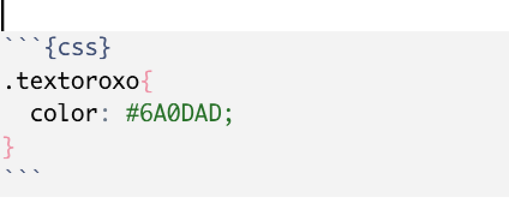

```{r, child="00-preamble.Rmd"}

```

class: middle, center

# Sobre a Curso-R

---

class: middle, center

## A empresa

.pull-left[
```{r, echo = FALSE}
knitr::include_graphics("https://d33wubrfki0l68.cloudfront.net/295643c6243701ae6a9bac3fb8ad467ff0ce3c84/d1785/img/logo/cursor1-41.png")
```

<br>
<br>

```{r, echo = FALSE}
knitr::include_graphics("img/logo_r6.png")
```

]

.pull-right[
```{r, echo = FALSE}
knitr::include_graphics("img/produtos.png")
```
]

### [www.curso-r.com](https://www.curso-r.com)


---
```{r, echo = FALSE}
templatesR6::criar_slide_nossos_cursos()
```
---
class: middle, center

# Sobre o curso

---

# Relatórios e apresentações automáticas


```{r, echo=FALSE, out.width="90%", fig.align='center', fig.cap="Ilustração por <a href='https://github.com/allisonhorst/stats-illustrations'> Allison Horst</a>."}
knitr::include_graphics("https://github.com/allisonhorst/stats-illustrations/blob/master/openscapes/environmental-data-science-r4ds-general.png?raw=true")
```


---
class: middle, center

```{r, echo=FALSE, out.width="100%", fig.align='center', fig.cap="Ilustração por <a href='https://github.com/allisonhorst/stats-illustrations'> Allison Horst</a>."}
knitr::include_graphics("https://github.com/allisonhorst/stats-illustrations/blob/master/rstats-artwork/rmarkdown_wizards.png?raw=true")
```


---

# Resultados


.pull-left[

No final, você poderá...

- Criar documentos reprodutíveis (como relatórios e apresentações)

- Compartilhar suas análises usando R em todas as etapas do ciclo da ciência de dados


]

.pull-right[

```{r, echo=FALSE, out.width="100%", fig.align='center', fig.cap="Ilustração por <a href='https://github.com/allisonhorst/stats-illustrations'> Allison Horst</a>."}
knitr::include_graphics(c("https://github.com/allisonhorst/stats-illustrations/blob/master/rstats-artwork/reproducibility_court.png?raw=true"))

```

]

---

# Dinâmica

- Exercícios para casa, com entrega facultativa

- __Trabalho final__, com entrega obrigatória
    - As pessoas que fizerem os trabalhos __mais legais__ receberão uma __bolsa__ para fazer qualquer curso da Curso-R
    - Mais detalhes sobre o trabalho final nas próximas aulas :)

---

# Tirando dúvidas

- **Não existe dúvida idiota**.
 
- Nem sempre é trivial fazer a pergunta certa para que outra pessoa esclareça a sua dúvida. Neste curso, **vamos mostrar melhores práticas na hora de fazer perguntas sobre programação**.
 
- Fora do horário de aula ou monitoria:
  - perguntas gerais sobre o curso deverão ser feitas no Classroom.
  - perguntas sobre R, principalmente as que envolverem código, deverão ser enviadas no [nosso discourse](https://discourse.curso-r.com/). Se envolver web scraping, é importante especificar a página que está querendo acessar e como você faria para encontrá-la manualmente.

- [Veja aqui dicas de como fazer uma boa pergunta](https://discourse.curso-r.com/t/como-escrever-uma-boa-pergunta/542).

---
# Por que usar o discourse?

- Muito melhor para escrever textos que possuem códigos. Com ele, podemos usar o pacote `{reprex}`!

- Saber pesquisar sobre erros e fazer a pergunta certa é essencial para aprender e resolver problemas de programação.

- No discourse, teremos mais pessoas acompanhando e respondendo as dúvidas.

- Em um ambiente aberto, as suas dúvidas vão contribuir com a comunidade.

### https://discourse.curso-r.com/

---


class: middle, center

# .blue[Introdução]

---
# O que é RMarkdown?

- O R Markdown é um pacote para criação de __relatórios automatizados__ utilizando as linguagens de programação R e de marcação Markdown. 

> Linguagens de marcação utilizam marcadores (símbolos, tags, funções) para formatar um arquivo de texto simples. Os exemplos mais famosos de linguagem de marcação são o HTML e LaTeX.

- A linguagem de marcação Markdown serve para construirmos e formatarmos diversos formatos de arquivos (PDF, HTML, Word, entre outros) a partir de um arquivo de texto com regras bem simples. 

- O __RMarkdown__ é uma extensão de Markdown que nos permite __colocar código de R__.


---
## Por que o RMarkdown é legal?

- Possibilita automatizar a criar produtos com o R. Construindo um relatório em RMarkdown, com exceção das interpretações e conclusões, só precisamos montá-lo uma vez. A partir daí, com apenas um clique podemos:

  - replicar o relatório para diversas versões da base de dados (modificações, correções, processos periódicos);

  - replicar o relatório para diversas variáveis.
  
.pull-left[
- Criar documentos reprodutíveis

- Criar diversos tipos de produtos 
]

.pull-right[
```{r, echo=FALSE, out.width="100%", fig.align='center', fig.cap="Ilustração por <a href='https://github.com/allisonhorst/stats-illustrations'> Allison Horst</a>."}
knitr::include_graphics("https://github.com/allisonhorst/stats-illustrations/blob/master/rstats-artwork/reproducibility_court.png?raw=true")

```
]


---

# Algumas aplicações

```{r echo=FALSE}
exemplos_rmd <- tibble::tibble(pacote = as.character(),
               desc = as.character(),
               exemplos = as.character()) %>%
  
  tibble::add_row(pacote = "[blogdown](https://bookdown.org/yihui/blogdown/)",
                  desc = "Blogs e sites",
                  exemplos = "- [Site da Curso-R](https://curso-r.com/) <br> - [Site da Associação Brasileira de Jurimetria (ABJ)](https://abj.org.br/)") %>%
  
  tibble::add_row(pacote = "[distill](https://rstudio.github.io/distill/)",
                  desc = "Blogs e sites",
                  exemplos = "- [RStudio AI Blog](https://blogs.rstudio.com/ai/) <br> - [Laboratório da Associação Brasileira de Jurimetria (ABJ)](https://lab.abj.org.br/)") %>%
  
  tibble::add_row(pacote = "[bookdown](https://bookdown.org/)",
                  desc = "Livros",
                  exemplos = "- [Livro Ciência de Dados em R](https://livro.curso-r.com/) <br> - [R for Data Science](https://r4ds.had.co.nz/)") %>%
  
  tibble::add_row(pacote = "[xaringan](https://github.com/yihui/xaringan)",
                  desc = "Apresentações",
                  exemplos = "- Essa apresentação (e todas as usadas nos cursos da Curso-R) <br> - [Build Your Own Universe - Garrick Aden-Buie & Travis Gerke](https://www.garrickadenbuie.com/talk/build-your-own-universe/)") %>%
  
  tibble::add_row(pacote = "[pagedown](https://github.com/rstudio/pagedown)",
                  desc = "Currículos, cartas e trabalhos acadêmicos",
                  exemplos = "- [Relatório do Observatório da Insolvência](https://abjur.github.io/obsFase2/relatorio/obs_recuperacoes_abj.pdf) <br>  - [Currículo do William Amorim](https://williamorim.github.io/resume/) ") %>%
  
    tibble::add_row(pacote = "[flexdashboard](https://rmarkdown.rstudio.com/flexdashboard/)",
                  desc = "Dashboards",
                  exemplos = "- [Tesouro Nacional: Análises sobre SICONF: Despesas com educação x IDEB](https://analise-siconfi-ideb.tesouro.gov.br/)") %>%
  
  
  tibble::add_row(pacote = "[learnr](https://rstudio.github.io/learnr/)",
                  desc = "Tutoriais interativos",
                  exemplos = "- [Text mining with tidy data principles](https://juliasilge.shinyapps.io/learntidytext/) <br> - [Teacups, Giraffes,  & Statistics](https://tinystats.github.io/teacups-giraffes-and-statistics/)") %>%
  
  tibble::add_row(pacote = "[rticles](https://github.com/rstudio/rticles)",
                  desc = "Artigos científicos",
                  exemplos = "   ") %>% 
  tibble::add_row(pacote = " ",
                  desc = "Outros exemplos",
                  exemplos = "[Newsletter Garimpo](https://nucleo.jor.br/newsletters/garimpo)") 
  


exemplos_rmd %>%
  dplyr::slice(1:4) %>% 
  knitr::kable(col.names = c("Pacote", "O que podemos fazer?", "Exemplos"))
```
---

# Algumas aplicações

```{r echo=FALSE}
exemplos_rmd %>%
  dplyr::slice(5:nrow(exemplos_rmd)) %>% 
  knitr::kable(col.names = c("Pacote", "O que podemos fazer?", "Exemplos"))
```

---

# Estrutura

Todo arquivo RMarkdown terá a seguinte estrutura:

--

.pull-left[

- Um preâmbulo com configurações
]

.pull-right[


```yaml
---
title: "Relatório maravilhoso"
*output: html_document
---
```

]

--

.pull-left[

- Blocos de texto (marcados em Markdown)

]

.pull-right[

````md
*Texto em __RMarkdown__!
````

]

--

.pull-left[

- Blocos de código (em R ou outra linguagem)

]

.pull-right[


````md
```{r}`r ''`
*print("ola, codigo R")
```
````

]

--

> Dependendo do formato de saída, o RMarkdown pode precisar ser dividido em vários arquivos ou precisar de arquivos adicionais.

---

# Vamos ao R!

```{r vamos-ao-r, echo=FALSE, fig.align='center'}

```

---

# Sintaxe Markdown


Principais marcadores utilizados para formatar texto:

- uma palavra entre asteriscos fica em itálico: `*texto*` é transformado em *texto*

- uma palavra entre dois asteríscos fica em negrito: `**texto**` é transformado em **texto**

- um ou mais hashtags viram títulos: `# Título muito grande`, `## Título grande`, `### Título médio`, `#### Título pequeno`, `##### Título muito pequeno`

- hiperlinks podem ser criados com a estrutura `[texto](link)`: 

- `[link para o site da Curso-R](https://curso-r.com)` é transformado em [link para o site da Curso-R](https://curso-r.com).

- para deixar o texto com `esse formato` (formato de código), apenas coloque o texto entre duas crases.


Material de consulta: [Livro: Ciência de Dados em R - Seção sobre Markdown](https://livro.curso-r.com/9-1-markdown.html)

---

# Chunks


- Em um arquivo R Markdown, precisamos escrever nossos códigos dentro dos *chunks*. Para inserir um chunk, utilize o atalho `CTRL + ALT + I`.

- É possível adicionar campos de código utilizando a seguinte sintaxe:

````md
```{r}`r ''`
codigo em R aqui
```
````

- Dentro dos chunks você poderá escrever códigos em R como se fosse o nosso script .R tradicional. 


Material de consulta: [Livro: Ciência de Dados em R - Seção sobre R Markdown](https://livro.curso-r.com/9-2-r-markdown.html)

---

# Yaml

- Os arquivos .Rmd começam com códigos em yaml.

- Esse "bloco" de código é delimitado por `---`.

- Apresenta metadados e parâmetros utilizados para gerar o documento final.

```{yml}
---
title: "Relatórios automáticos"
subtitle: "O poder do RMarkdown"
author: "Curso-R"
date: "Março de 2021"
output: xaringan::moon_reader
---
```

---

## Knit! 

- Para gerarmos o relatório na extensão desejada, precisamos *renderizá-lo*, isto é, transformar o arquivo R Markdown em um PDF, HTML ou Word. 

- Isso pode ser feito no RStudio a partir do botão `knit`, que fica logo acima do script, ou pelo atalho `CTRL + SHIFT + K`.

```{r, echo=FALSE, fig.align="center", out.width="100%", fig.cap="Fonte: <a href='https://rmarkdown.rstudio.com/articles_integration.html'>RStudio</a>"}
knitr::include_graphics("https://d33wubrfki0l68.cloudfront.net/ac50fc099900e8dd42fb3858cc9b54b00c3a26a6/25493/articles/images/rmdint-dropdown.png")
```


---
class: middle, center

# .blue[Principais saídas]

```{r, echo=FALSE,   out.width="45%", fig.cap="<center><b>Fonte: <a href='https://rmarkdown.rstudio.com'>Pacote `rmarkdown`</a></b></center>"}
knitr::include_graphics("https://r-ladies-sao-paulo.github.io/xaringan/img/markdown.png")
```

<!-- Quero usar essa imagem, mas não está claro se é liberado o uso: https://alison.netlify.app/rmd-valentine/images/rmarkdown_hedgehog_wide.png -->

---
## Relatórios


### HTML

```{yml}
output: html_document
```

### Word (.docx)

```{yml}
output: word_document
```

---

## Relatórios

### PDF (com Tex)

```{yml}
output: pdf_document
```

Caso não tenha o TeX:

```{r eval=FALSE, include=TRUE}
tinytex::install_tinytex()
```


---


## Relatórios

### PDF com o pacote Pagedown

```{yml}
output: html_document
knit: pagedown::chrome_print
```


Ou utilize a função `pagedown::chrome_print()` em um relatório em HTML:

```{r eval=FALSE, include=TRUE}
pagedown::chrome_print("relatorio.html")
```

---


## Apresentações

- **Powerpoint** 
```{yml}
output: powerpoint_presentation
```

- **xaringan** 
```{yml}
output: xaringan::moon_reader
```

---

## Resumo

- Podemos escrever arquivos com código, resultados, textos, imagens, etc. 

- O mesmo conteúdo pode ser disponibilizado em diferentes tipos de saída.

- Nos metadados (`yaml`) do arquivo RMarkdown `.Rmd`, definimos a saída no parâmetro `output`.

- Mais saídas: [RStudio Formats](https://rmarkdown.rstudio.com/formats.html)

---
# Referências 

## Em Inglês

- [Site do pacote RMarkdown](https://rmarkdown.rstudio.com/)
  - [Página com diversas referências](https://rmarkdown.rstudio.com/articles.html)
- [Folha de cola - _cheatsheet_](https://github.com/rstudio/cheatsheets/raw/master/rmarkdown-2.0.pdf)
- [Livro: _R Markdown: The Definitive Guide_](https://bookdown.org/yihui/rmarkdown/)
- [Livro: _R Markdown Cookbook_](https://bookdown.org/yihui/rmarkdown-cookbook/)
- Pessoas para seguir no Twitter:
  - [Yihui Xie](https://twitter.com/xieyihui)
  - [Garrick Aden-Buie](https://twitter.com/grrrck) 
  - [Alison Presmanes Hill](https://twitter.com/apreshill)


## Em Português

- [Livro da Curso-R - Capítulo sobre relatórios](https://livro.curso-r.com/9-relatorios.html)


---
class: center, middle

# .blue[Introdução à HTML e CSS]


---


## Introdução à HTML e CSS

- Quando criamos um arquivo RMarkdown que gera um output em `.html`, esse arquivo `.html` é interpretado pelo navegador (ex. Chrome), utilizando também os arquivos `.css` e `.js`

  - **HTML** (HyperText Markup Language - Linguagem de Marcação de Hipertexto): é uma linguagem de marcação, é usado para estruturar páginas da internet (websites).
  
  - **CSS** (Cascading Style Sheets - Folha de Estilo em Cascata): é usado para estilizar os elementos escritos no HTML.

  - **Javascript**: é uma linguagem de programação, permite que as páginas sejam dinâmicas.
  

```{r echo=FALSE, out.width="50%", eval = TRUE}
knitr::include_graphics("img/html-css-javascript.jpg")
```

---
class: 

## HTML 🧱 🏗 


- HTML descreve a estrutura de uma página web.

- HTML consiste em uma série de elementos. Estes elementos mostram para o navegador (o browser) como apresentar o conteúdo.

- Um elemento em HTML consiste em uma tag inicial, algum conteúdo que será marcado, e a tag final (que é diferente da tag inicial por possuir a barra `/` )

```
<nomedatag>Conteúdo a ser marcado vai aqui...</nomedatag>
```

- Elementos em HTML podem ter atributos de classe (`class`). As classes geralmente são usadas para referenciar um estilo.


```
<nomedatag class="nomedaclasse">
Conteúdo a ser marcado vai aqui...
</nomedatag>
```

---
class: 


### Exemplo  🧱 🏗 

.panelset[


.panel[.panel-name[Código em Markdown]

``` 
Este é o curso de **Relatórios e visualização de dados**,
oferecido pela [Curso-R](https://curso-r.com/).
```
]

.panel[.panel-name[Código HTML]

```
<p> 
Este é o curso de <b>Relatórios e visualização de dados</b>,
oferecido pela <a href='https://curso-r.com/'>Curso-R</a>.
</p> 
```
]


.panel[.panel-name[Como aparece]

<p> 
Este é o curso de <b>Relatórios e visualização de dados</b>,
oferecido pela <a href='https://curso-r.com/'>Curso-R</a>.
</p> 
]


]


---
class: 

## CSS  🎨 

- CSS é uma sigla para *Cascading Style Sheets* (tradução literal: folha de estilo em cascada).

- CSS descreve como os elementos em HTML serão apresentados.

- Você pode criar estilos no seu arquivo `.Rmd`, ou também salvar em um arquivo externo. As folhas de estilo são salvas em arquivos com a extensão `.css`.

- Você pode criar um arquivo CSS e reaproveitar em diversos arquivos HTML. 

- Criar estilos no seu arquivo `.Rmd`:
  - Colocando o estilo dentro de uma tag html `<style>` 
  - Criando um Chunk de código CSS

---
class:

### Exemplo de código CSS  🎨 

.panelset[

.panel[.panel-name[Exemplo de elementos]

- Para elementos, usamos a seguinte estrutura:

````CSS
nomedoelemento {

  propriedade: valor da propriedade;

}

````

Exemplo: 

````CSS
p {

  font-size: 20px;  

}

````
]


.panel[.panel-name[Exemplo de classe]

- Para classes, usamos a estrutura dos elementos, porém adicionando um ponto antes:

````CSS
.nomedaclasse {

  propriedade: valor da propriedade;

}

````

Exemplo: 

````CSS
.textogrande {

  font-size: 40px;  

}

````

]


]

---
class: 


### Exemplo 1 🎨 

.panelset[

.panel[.panel-name[Código HTML]

```
<style>
.textorosa{
color: pink;

}
</style>
<p> 
Este é o curso de 
<b class="textorosa">Relatórios e visualização de dados</b>,
oferecido pela <a href='https://curso-r.com/'>Curso-R</a>.
</p> 
```
]


.panel[.panel-name[Como aparece]

<style>
.textorosa{
color: pink;

}
</style>
<p> 
Este é o curso de 
<b class="textorosa">Relatórios e visualização de dados</b>,
oferecido pela <a href='https://curso-r.com/'>Curso-R</a>.
</p> 
]


]

---
class: 

### Exemplo 2  🎨 

.panelset[


.panel[.panel-name[Código em Markdown]


```{r echo=FALSE, out.width="50%", eval = TRUE, fig.align='left'}

```


``` 

Este é o curso de .textoroxo[**Relatórios e visualização de dados**],
oferecido pela [Curso-R](https://curso-r.com/).
```
]


.panel[.panel-name[Como aparece]


```{css}
.textoroxo{
  color: #6A0DAD;
}
```

Este é o curso de .textoroxo[**Relatórios e visualização de dados**],
oferecido pela [Curso-R](https://curso-r.com/).

]


]

---

## Dica de ouro 🚩

Use **muito** as ferramentas de desenvolvedor(a) do navegador.

Permite explorar o conteúdo de uma página web. 

Atalho costuma ser: **CTRL + SHIFT + C**

- [Firefox - Page inspector](https://developer.mozilla.org/pt-BR/docs/Tools/Page_Inspector)

- [Chrome](https://support.google.com/campaignmanager/answer/2828688?hl=pt-BR)


---
class:

## Referências 📖

- [Mozilla Web Docs](https://developer.mozilla.org/pt-BR/docs/Learn/Getting_started_with_the_web)

- [w3schools.com - HTML](https://www.w3schools.com/html/default.asp)

- [w3schools.com - CSS](https://www.w3schools.com/css/)


## Estudo 📚

- [Free Code Camp](https://www.freecodecamp.org/learn/responsive-web-design/)

- [Palestra do Garrick Aden-Buie: Using xaringan to learn web development](https://rstudio.com/resources/rstudioglobal-2021/xaringan-playground-using-xaringan-to-learn-web-development/)

---
class: center, middle

# .blue[Compartilhando os resultados]

---

## Compartilhando os resultados

Podemos facilmente enviar os arquivos PDF e `.docx` via e-mail. Porém e no caso do output ser um HTML?

No HTML, muitas vezes o arquivo depende de outros arquivos (ou seja, ele não é auto-contido).

Podemos usar uma opção que permite fazer um arquivo autocontido, sem dependências (porém isso deixará seu arquivo grande, e também pode demorar para ser gerado):

```{{r}}
---
output:
  html_document:
    self_contained: true
---
```

https://bookdown.org/yihui/rmarkdown/html-document.html

---

## Disponibilizar na internet

Outra forma é disponibilizar o HTML na internet, com serviços como Netlify Drop ou GitHub ! 

> DICA IMPORTANTE: Busque nomear seus arquivos como `index.html`

### Disponibilizar utilizando o Netlify Drop

- https://app.netlify.com/drop

- Gratuito

- Para quem não usa GitHub.

- Podemos subir uma pasta com todo o conteúdo dentro.

- Mais fácil, mas não dá pra ficar atualizando o material depois de um jeito fácil.

---

## Disponibilizar utilizando o GitHub

- Gratuito

- Precisa saber o básico de Git e GitHub

- O projeto precisa estar vinculado a um repositório no GitHub

- No repositório do pacote, clique em **Settings**, e no menu lateral escolha **Pages**

- Em **Source**, selecione a sua branch principal (provavelmente chama de **main** ou **master**), escolha o diretório onde seus arquivos estão: `docs/` ou `root/` (a pasta raíz) e clique em **save**.


- O endereço do site será `https://seu-username.github.io/nome-repositorio/caminho-do-arquivo.html`  


---
class: center, middle

# .blue[Extensões]

---

## pagedown

---

## xaringan

---

## rticles

---

## flexdashboard

---

## bookdown


---
class: center, middle

# .blue[E o futuro? Quarto!]

https://quarto.org/


